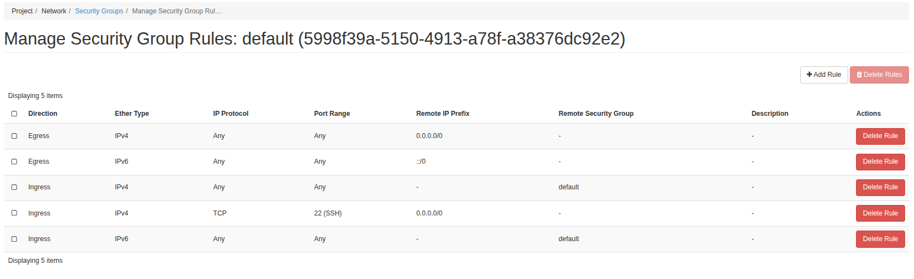

# ☁️ Building a Local Cloud with OpenStack (DevStack Edition)

## Contents

1. [Introduction](#1-introduction)  
2. [Installing OpenStack](#2-installing-openstack)  
   2.1 [Can I Install On My Local PC?](#21-can-i-install-on-my-local-pc)  
   2.2 [I Guess I Can Install!](#22-i-guess-i-can-install)  
   2.3 [Getting Lots Of Errors...](#23-getting-lots-of-errors)  
3. [Changing Direction to the DevStack](#3-changing-direction-to-the-devstack)  
   3.1 [Creating a VM for DevStack](#31-creating-a-vm-for-devstack)  
   3.2 [Installing DevStack inside the VM](#32-installing-devstack-inside-the-vm)  
4. [Looking Inside Our Cloud](#4-looking-inside-our-cloud)  
   4.1 [Uploading Ubuntu Image to Our Cloud](#41-uploading-ubuntu-image-to-our-cloud)  
   4.2 [Creating a New Instance](#42-creating-a-new-instance) 
## 1. Introduction

Hello, in this repository my main aim is to create a system on my local pc that acts as a cloud. In here openstack comes to my help actually. This tool has what you need in order to make what you want! 

## 2. Installing Openstack

### 2.1. Can I Install On My Local Pc?

First we have to figure out where we can install Openstack and how to run it. [This post](https://stackoverflow.com/questions/10856551/is-it-possible-to-run-openstack-on-a-laptop-desktop) says that i can run openstack where there is a linux distribution. I wanna be sure because this post is 13 years old...

While scrolling I came up to [this article](https://ubuntu.com/openstack/install). This is official ubuntu's openstack installation article which is great for me since I am using Ubuntu.

### 2.2. I Guess I Can Install!

According to the article, lets install step by step:
```bash
sudo snap install openstack
```

After the installation, we are suggested that we can use this script:
```bash
sunbeam prepare-node-script --bootstrap
```

We can use the script like this:
```bash
sunbeam prepare-node-script --bootstrap | bash -x && newgrp snap_daemon
```

---

### 2.3. Getting Lots Of Errors...

While trying to install openstack via [ubuntu's official site](https://ubuntu.com/openstack/install), I got lots of errors and I couldn't solve them. After that I made some research and I found out that for education purposes DevStack is being used and also for beginners. For this purpose I will create a new vm ubuntu 22.04 jammy server and lots of memory(I want it to be fast). 

## 3. Changing Direction to the DevStack

I will continue with DevStack which makes more sense...

### 3.1. Creating a Vm for DevStack 

First, we have to create a VM on our Oracle VirtualBox with the image ubuntu 22.04 jammy server(To make it more faster, I won't use os's GUI).

Resources given to the VM (to make it fast!)
- 25 GB RAM
- 200 GB Memory
- 16 Cpu Core(s)

### 3.2. Installing DevStack inside the Vm

After creating a Vm, we can now move on to the installation phase in [this link.](https://docs.openstack.org/devstack/latest/)

But before this, I want to tell what I did. To access and edit inside of the ubuntu server, I created a Port Forwarding to use ssh from the host pc. With this approach, I am more in control while using the terminal(I cannot easily use oracle virtual box's terminal. Its annoying at some point...)

---

First lets create a new user:
```bash
sudo useradd -s /bin/bash -d /opt/stack -m stack
```

After that, we can give executable permissions to our newly created user:
```bash
sudo chmod +x /opt/stack
```

We also need sudo privileges:
```bash
echo "stack ALL=(ALL) NOPASSWD: ALL" | sudo tee /etc/sudoers.d/stack
sudo -u stack -i
```

And then lets download DevStack:
```bash
git clone https://opendev.org/openstack/devstack
cd devstack
```

---

After this step, to control my terminal, I added this configuration:
```bash
nano ~/.inputrc
"\C-h": backward-kill-word
```
This command lets you delete words with ctrl + backspace which is needed while working in a terminal environment!

---

After downloading the DevStack, we can create a local.conf file with the contents like this:
```conf
[[local|localrc]]
ADMIN_PASSWORD=secret # I changed this value of course...
DATABASE_PASSWORD=$ADMIN_PASSWORD
RABBIT_PASSWORD=$ADMIN_PASSWORD
SERVICE_PASSWORD=$ADMIN_PASSWORD
```

After this step, we can start to install:
```bash 
./stack.sh
```

This command download and installs lots of packages, therefor it will take time to download based on your internet connection.

```output
2025-06-02 11:53:56.737 | stack.sh completed in 1693 seconds.
```
If you managed to see this output, congratulations! You successfully installed DevStack to you server or hardware!

## 4. Looking Inside Our **Cloud**

Lets go to the openstack dashboard and try to gain some knowledge:


From the image we can see that our cloud is up and running which is great!

### 4.1. Lets Upload Ubuntu Image to Our Cloud!

First intall image to the Vm like this:
```bash
wget https://cloud-images.ubuntu.com/jammy/current/jammy-server-cloudimg-amd64.img
```

To get access for openstack commands, we can use this command:
```bash
source ~/devstack/openrc admin admin
```

And uplaod image to the `Glance` service:
```bash
openstack image create "ubuntu-22.04" \
  --file jammy-server-cloudimg-amd64.img \
  --disk-format qcow2 \
  --container-format bare \
  --public
```

```bash
### NOTE: This is the same command but with commands
# image name to show on openstack
openstack image create "ubuntu-22.04" \ 
  # file path \
  --file jammy-server-cloudimg-amd64.img \
#   file format of the disk image \
  --disk-format qcow2 \ 
  # even tho i loooked for this, i have no idead what is does... \
  --container-format bare \
  # makes available to the all users using Openstack \
  --public 
```

If you got this kind of output then its uploaded to our local cloud:


If we look at the dashboard, we can also see that our image has arrived there too:

Note: The first image is DevStack's default image. It's a tiny Linux distribution (CirrOS) used to test the basic functionality of OpenStack.

### 4.2. Creating a New Instance

Lets create a new instance with our newly uploaded image!

First we have to look which type of [virtual machine we can use:](https://docs.openstack.org/nova/rocky/user/flavors.html)
```bash
openstack flavor list
```


And select one, lets select `m1.small` for faster response.

Then check our networks:
```bash
openstack network list
```

And we can select public network since we are in our local pc `1e22cc02-8942-43cb-8094-77e577db18e3`

Then we can create a new key-pair. We need this key in order to login our virtual instances rather than password.
```bash
openstack keypair create --public-key ~/.ssh/id_rsa.pub mykey
```

This is the output.

--- 

Lets create the instance:
```bash
openstack server create \
  --flavor m1.small \
  --image ubuntu-22.04 \
  --nic net-id=1e22cc02-8942-43cb-8094-77e577db18e3 \
  --key-name mykey \
  --security-group 5998f39a-5150-4913-a78f-a38376dc92e2 \
  my-first-instance
```

Voila! We created the instance. Lets get into that vm and see if it really works.


--- 

We can see servers with this:
```bash
openstack server list
```


After seeing that our image is live, we can continue to more configurations. Turns out oo access our instances, we have to make some adjustments:

 - Assigning a floating IP
 - Allow port 22 (which is ssh)

Lets start slowly and open the port 22 with this command:
```bash
openstack security group rule create --proto tcp --dst-port 22 --ingress [security_gruop_id]
```

After running this command, we can see that our security group opened the port 22:



Now lets createa a new floating ip:
```bash
openstack floating ip create public
```

And associate this ip to our instance like this:
```bash
openstack server add floating ip my-first-instance 172.24.4.41
```

Then we can go inside the instance like this:
```bash
ssh -i ~/.ssh/mykey.pem ubuntu@172.24.4.134
```

And yes, with ssh, we are inside the instance!!!

---

Final Note:

Here is the thing, I tried to login via ssh from my host not inside the openstack but I couldn't. I don't know how. Its because I am using Bridge network on my VirtualBox and I can only connect to the DevStack IP via ssh. Since instance's floating IP is inside of DevStack, I cannot use ssh to login from the host. I can login from the DevStack Vm tho. I guess it's not that bad.

