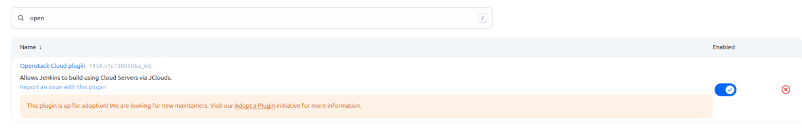
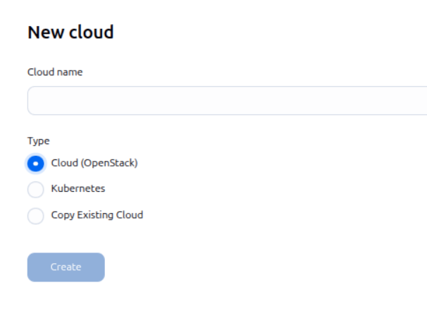
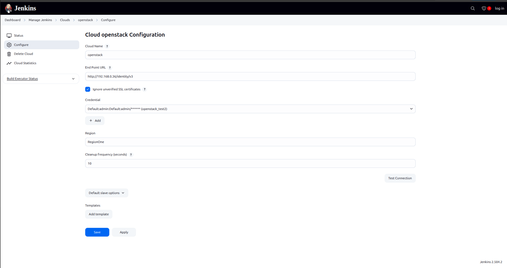
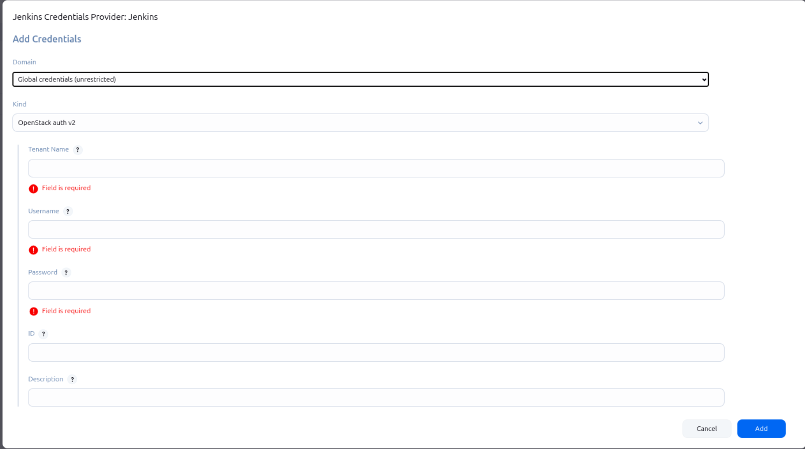
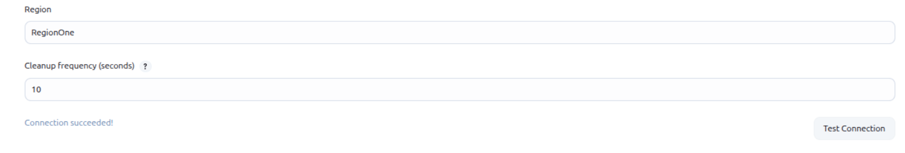

## Connect Jenkins to the Openstack

First we have to go to our jenkins and install a plugin:

After installing this plugin, we are good to go. Now lets move to the `Manage Jenkins > Clouds > New Cloud`

After selecting `Cloud(OpenStack)` option, we can now configure more...

---

This is how our configurations look like:

- Our OpenStack uses v3, so thats why our endpoint is `http://192.168.0.36/identity/v3`.

- We have to create a credential to login and use our `local cloud`!

After these steps, we can now move on and test our connection just like this:

And yess. We are successfully connected to our `cloud`.