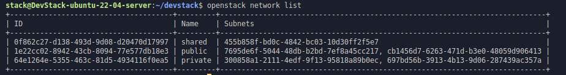

## 1. Creating a New Instance

Lets create a new instance with our newly uploaded image!

First we have to look which type of [virtual machine we can use:](https://docs.openstack.org/nova/rocky/user/flavors.html)
```bash
openstack flavor list
```


And select one, lets select `m1.small` for faster response.

Then check our networks:
```bash
openstack network list
```

And we can select public network since we are in our local pc `1e22cc02-8942-43cb-8094-77e577db18e3`

Then we can create a new key-pair. We need this key in order to login our virtual instances rather than password.
```bash
openstack keypair create --public-key ~/.ssh/id_rsa.pub mykey
```

This is the output.

--- 

Lets create the instance:
```bash
openstack server create \
  --flavor m1.small \
  --image ubuntu-22.04 \
  --nic net-id=1e22cc02-8942-43cb-8094-77e577db18e3 \
  --key-name mykey \
  --security-group 5998f39a-5150-4913-a78f-a38376dc92e2 \
  my-first-instance
```

Voila! We created the instance. Lets get into that vm and see if it really works.


--- 

We can see servers with this:
```bash
openstack server list
```


After seeing that our image is live, we can continue to more configurations. Turns out oo access our instances, we have to make some adjustments:

 - Assigning a floating IP
 - Allow port 22 (which is ssh)

Lets start slowly and open the port 22 with this command:
```bash
openstack security group rule create --proto tcp --dst-port 22 --ingress [security_gruop_id]
```

After running this command, we can see that our security group opened the port 22:


Now lets createa a new floating ip:
```bash
openstack floating ip create public
```

And associate this ip to our instance like this:
```bash
openstack server add floating ip my-first-instance 172.24.4.41
```

Then we can go inside the instance like this:
```bash
ssh -i ~/.ssh/mykey.pem ubuntu@172.24.4.134
```

And yes, with ssh, we are inside the instance!!!

---

Final Note:

Here is the thing, I tried to login via ssh from my host not inside the openstack but I couldn't. I don't know how. Its because I am using Bridge network on my VirtualBox and I can only connect to the DevStack IP via ssh. Since instance's floating IP is inside of DevStack, I cannot use ssh to login from the host. I can login from the DevStack Vm tho. I guess it's not that bad.