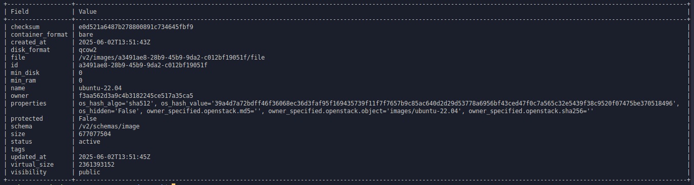
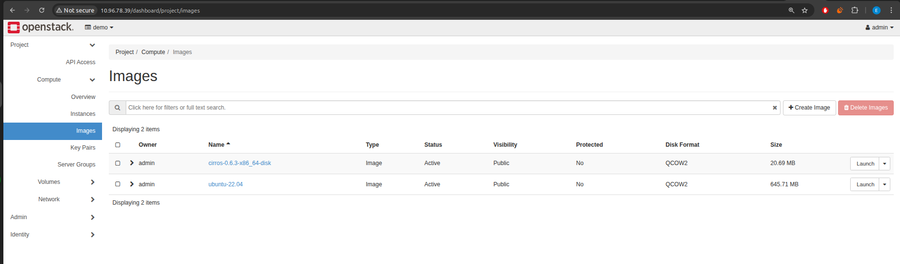

## Contents

- [Looking Inside Our](#1-looking-inside-our-cloud)
- [Lets Upload Ubuntu Image to Our Cloud!](#11-lets-upload-ubuntu-image-to-our-cloud)


## 1. Looking Inside Our **Cloud**

Lets go to the openstack dashboard and try to gain some knowledge:


From the image we can see that our cloud is up and running which is great!

### 1.1. Lets Upload Ubuntu Image to Our Cloud!

First intall image to the Vm like this:
```bash
wget https://cloud-images.ubuntu.com/jammy/current/jammy-server-cloudimg-amd64.img
```

To get access for openstack commands, we can use this command:
```bash
source /opt/stack/devstack/openrc admin admin
cd /opt/stack/devstack/
```

And uplaod image to the `Glance` service:
```bash
openstack image create "ubuntu-22.04" \
  --file jammy-server-cloudimg-amd64.img \
  --disk-format qcow2 \
  --container-format bare \
  --public
```

```bash
### NOTE: This is the same command but with commands
# image name to show on openstack
openstack image create "ubuntu-22.04" \ 
  # file path \
  --file jammy-server-cloudimg-amd64.img \
#   file format of the disk image \
  --disk-format qcow2 \ 
  # even tho i loooked for this, i have no idead what is does... \
  --container-format bare \
  # makes available to the all users using Openstack \
  --public 
```

If you got this kind of output then its uploaded to our local cloud:


If we look at the dashboard, we can also see that our image has arrived there too:

Note: The first image is DevStack's default image. It's a tiny Linux distribution (CirrOS) used to test the basic functionality of OpenStack.
